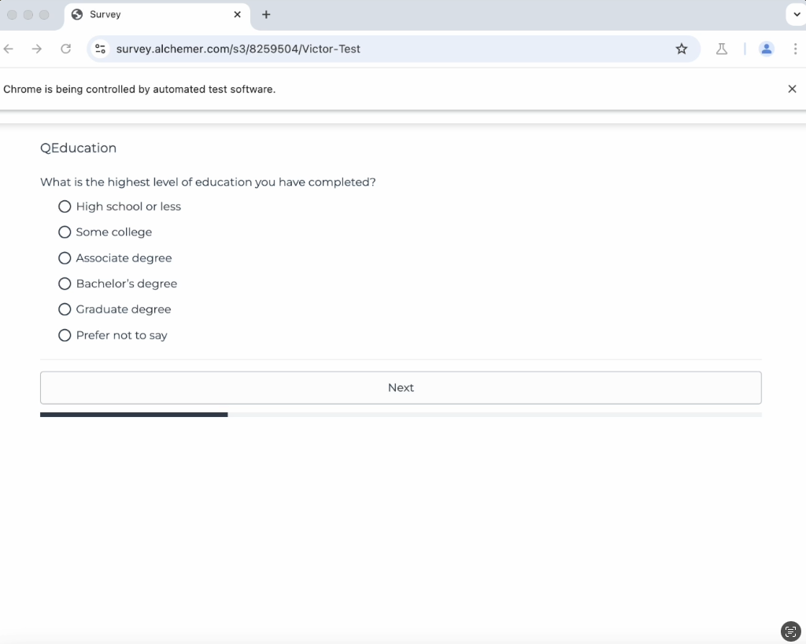
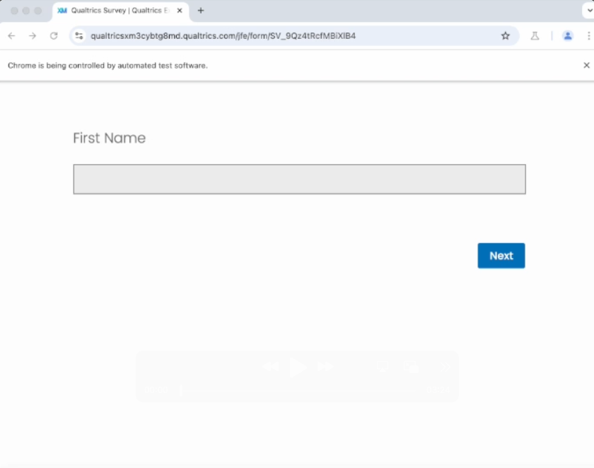

# Survey Testing Automation

## Overview

This application automates the process of completing online polls, for the purpose of quickly generating test responses. It can navigate through different survey platforms, customize the response distributions for any question, and when necessary, use natural language processing (via Browserbase's Stagehand framework and via Anthropic's Computer Use capabilities) to correct errors and proceed through the survey. The application is also connected to Browserbase's infrastructure to enable the running of concurrent browser instances and generation of multiple test responses at once. Logs are displayed as well.

## Why I Chose This Problem

Survey testing (often in the form of "paths testing") is a manual process for most polling firms, often taking multiple hours across multiple people. There's a paths sheet that's set up (a spreadsheet denoting the different "paths" through the survey that all need to be tested), and then filling out that sheet requires individuals manually taking the survey on the front end to go through each path, logging errors for display logic and other settings.

The ability to quickly auto-generate test responses would cut down on the testing time significantly, enable far more test completions than manual methods, AND allow for a smoother launch of the poll (since the process of "soft-launching" 10% of the sample + pausing fielding to check the integrity of the initial data would no longer be necessary.)

The built-in tools that platforms like Alchemer and Qualtrics have for generating test responses are ineffective for several reasons, most notably that the inability to customize the answer distributions means that the test responses are unable to get past all kinds of basic screener questions (e.g., zip code disqualifications).

## Instructions for local use

Ensure that your environment variables for ANTHROPIC_API_KEY, BROWSERBASE_API_KEY, BROWSERBASE_PROJECT_ID, and USE_BROWSERBASE are set up in an .env file, with USE_BROWSERBASE set to true. When the application launches, you can:

1. Enter the survey URL in the "Survey URL" field
2. Add any questions where you need to customize the answer distributions, and remove the ones where you don't
3. Click "Generate Headed Test Run". Here, a browser will pop up on your screen and automatically navigate through your survey, answering questions based on your configuration
4. The logs will tell you want has happened after the browser closes
5. To generate multiple test responses, click "Generate Headless Test Responses". This time, no browser will pop up since the instances are headless (though, I'm able to see the survey-taking sessions in real-time through the Browserbase platform). The logs will again provide step-by-step details upon completion.

## Error Handling Mechanisms

The application has multiple fall-back mechanisms for handling validation errors:

1. **First Level: Generic AI Instruction**
   - When an error is detected, the system uses Stagehand's `act` method with a generic instruction: "Please fix the error on this page"

2. **Second Level: Screenshot Analysis To Retrieve Detailed Error Description**
   - If the generic approach fails, the application takes a screenshot of the page
   - The application sends the screenshot to Anthropic's API and asks for a concise description of the error
   - Claude provides a specific description of the error
   - This description is passed to a second `act` call for more targeted resolution

3. **Third Level: Computer Use Model**
   - If the screenshot approach fails, the application turns to Anthropic's Computer Use model to fix the error

## Example Videos of Headed Test Runs

### Alchemer Survey Testing Automation

This video demonstrates a complete headed test run through an Alchemer survey. In the video above, you can see that for the error encountered in QIssues (a select-multiple question requiring a minimum of three options to be selected), both the initial and second `act` command (the latter having a specific error description from screenshot analysis) failed, but the Computer Use agent was able to successfully fix the issue. In contrast, for the error encountered in later open end questions (requiring a minimum character count of 3), stagehand's first `act` call was enough to resolve the issue, even with just a generic instruction.

### Qualtrics Survey Testing Automation

This video demonstrates a complete headed test run through a Qualtrics survey. It also encounters similar stumbling blocks that the Alchemer test encountered, and resolves them the same way.

## Future Improvements

1. **Enhanced Platform Generalizability**
   - While the application has been validated with Alchemer and Qualtrics (covering a large percentage of polling firms), testing across additional platforms would improve reliability
   - Further testing with rarer question types (sliders, ranking questions, etc.) would expand capabilities
   - Some of the error  detection code may need refinement for platforms not yet encountered

2. **UX/UI Enhancements**
   - Improve the front-end design for a more polished user experience
   - Add "paste-in" functionality to easily import answer options from existing questionnaires
   - Develop better visualization of test results and error patterns

3. **Scaled Concurrent Testing**
   - The current limit of 3 concurrent headless tests is due to Browserbase's hobby plan restrictions
   - Upgrading to a higher tier plan would enable many more concurrent test responses
   - The architecture is designed to scale easily with higher tier plans

